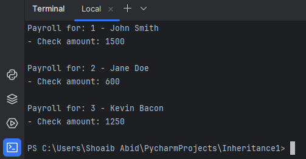

<!DOCTYPE html>
<html lang="en">

<body>

  <h1>Employee Payroll System</h1>

  
This project serves as an illustrative example of class hierarchies in Python, showcasing the implementation of an HR system designed for payroll processing. The system employs the concept of inheritance to model different types of employees.

  <h2>Class Hierarchy</h2>

  
The project defines a class hierarchy with a base class, <code>Employee</code>, and several derived classes, including <code>SalaryEmployee</code>, <code>HourlyEmployee</code>, and <code>CommissionEmployee</code>. Each derived class provides a specific implementation of the <code>calculate_payroll()</code> method, allowing for flexibility and customization based on employee type.

  

  <h2>Implementation Overview</h2>

  
The heart of the system lies in the <code>Employee</code> base class, which encapsulates common attributes shared among all employee types. The derived classes extend this base, introducing specialized attributes and behaviors.

  
The <code>PayrollSystem</code> class orchestrates the payroll calculation process. It iterates through a collection of employees, leveraging their specific <code>calculate_payroll()</code> methods to determine individual compensation.

  <h2>Example Usage</h2>

  
To demonstrate the system in action, consider the following Python script:

  <pre><code>import hr

# Create instances of different employee types
salary_employee = hr.SalaryEmployee(1, 'John Smith', 1500)
hourly_employee = hr.HourlyEmployee(2, 'Jane Doe', 40, 15)
commission_employee = hr.CommissionEmployee(3, 'Kevin Bacon', 1000, 250)

# Initialize the PayrollSystem
payroll_system = hr.PayrollSystem()

# Calculate payroll for the given employees
payroll_system.calculate_payroll([
    salary_employee,
    hourly_employee,
    commission_employee
])
</code></pre>

  <h2>Output</h2>

  
The system generates output in the terminal, providing insights into the calculated payroll for each employee. A placeholder for the output screenshot is provided below:

  
[Output Screenshot Placeholder]

  

</body>

</html>
