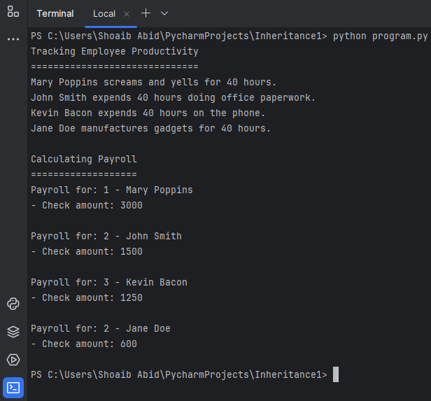

<!DOCTYPE html>
<html lang="en">

<body>

  <h1>Class Explosion Problem and Productivity System</h1>

  
In software development, the class explosion problem can arise when inheritance leads to a complex and hard-to-maintain hierarchical structure. This issue becomes evident when adding new functionalities, as seen in this project.

  <h2>Moving to an Employees Module</h2>

  
To address the evolving requirements, the classes related to employees have been moved to a dedicated <code>employees</code> module. This module now includes various employee types, each designed to work with both the <code>PayrollSystem</code> and the newly introduced <code>ProductivitySystem</code>.

  <h3>New Employee Types</h3>

  
The employee module now contains additional employee types:

  <ul>
    <li><code>Manager</code>: Salaried employees who manage and lead.</li>
    <li><code>Secretary</code>: Salaried employees handling administrative tasks.</li>
    <li><code>SalesPerson</code>: Employees with a base salary and commissions for sales.</li>
    <li><code>FactoryWorker</code>: Hourly employees working in manufacturing.</li>
  </ul>

  
Each employee type implements a <code>work()</code> method to support productivity tracking.

  <h3>New Productivity System</h3>

  
The <code>ProductivitySystem</code> class is introduced to track employee productivity based on their roles. The system works by calling the <code>work()</code> method for each employee, taking into account the number of hours worked.

  <h2>New Class Hierarchy</h2>

 

  <h2>Output Results</h2>

  

</body>

</html>
