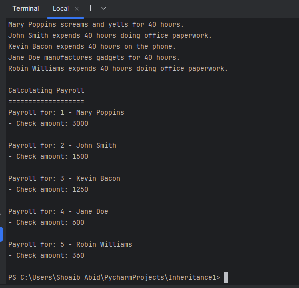

# Solving the Diamond Problem in Python

Diamond Problem Overview

Addressing the diamond problem in a class hierarchy involving TemporarySecretary class.





## Diamond Problem Resolution


Resolved the diamond problem by managing the order of inheritance and explicitly invoking methods.

### Code Snippet

```python
class TemporarySecretary(Secretary, HourlyEmployee):
    def __init__(self, id, name, hours_worked, hour_rate):
        HourlyEmployee.__init__(self, id, name, hours_worked, hour_rate)

    def calculate_payroll(self):
        return HourlyEmployee.calculate_payroll(self)
```

## Run the Program

Ensure Python is installed, then run:

```bash
python program.py
```

## Additional Resources

- [Understanding Python's Method Resolution Order (MRO)](https://realpython.com/python-method-resolution-order/)
- [Diamond Problem in Object-Oriented Design](https://en.wikipedia.org/wiki/Multiple_inheritance#The_diamond_problem)

