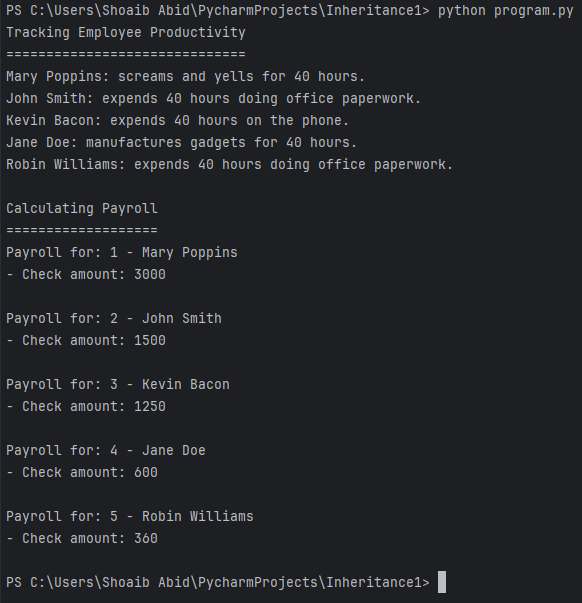

# Refactoring for Modularity

## Overview

This branch addresses the diamond problem by refactoring the class hierarchy to improve modularity. The Employee derived classes are now designed to work seamlessly with two different systems: the productivity system and the payroll system.

## Changes Made

- Moved productivity-related classes to the `productivity` module.
- Moved payroll-related classes to the `hr` module.
- Introduced role and policy classes to avoid diamond problem complexities.
- Updated the `employees` module to utilize the new modular structure.

## Class Hierarchy

[](https://files.realpython.com/media/ic-inheritance-policies.0a0de2d42a25.jpg)

## Output Screenshot



## Usage

Ensure Python is installed, then run:

```bash
python program.py
