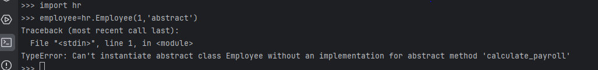

<!DOCTYPE html>
<html lang="en">

<body>

  <h2>Changes in Abstract Base Classes Branch</h2>

  
This branch introduces modifications to the <code>hr.py</code> file, focusing on the implementation of Abstract Base Classes (ABC) in Python. The primary goal is to enhance code structure and enforce specific behaviors for derived classes.

  
The <code>Employee</code> class is now an abstract base class, signified by the usage of the <code>ABC</code> module and the <code>@abstractmethod</code> decorator for the <code>calculate_payroll()</code> method.

  <pre><code># In hr.py (Abstract Base Classes Branch)

from abc import ABC, abstractmethod

class Employee(ABC):
    def __init__(self, id, name):
        self.id = id
        self.name = name

    @abstractmethod
    def calculate_payroll(self):
        pass
</code></pre>

  
These changes communicate that objects of type <code>Employee</code> cannot be directly instantiated. Additionally, any class derived from <code>Employee</code> within this branch must provide a concrete implementation for the <code>calculate_payroll()</code> method.

  <h2>Output Screenshot</h2>

  
To showcase the changes made in this branch, here is an output screenshot:

  

</body>

</html>
